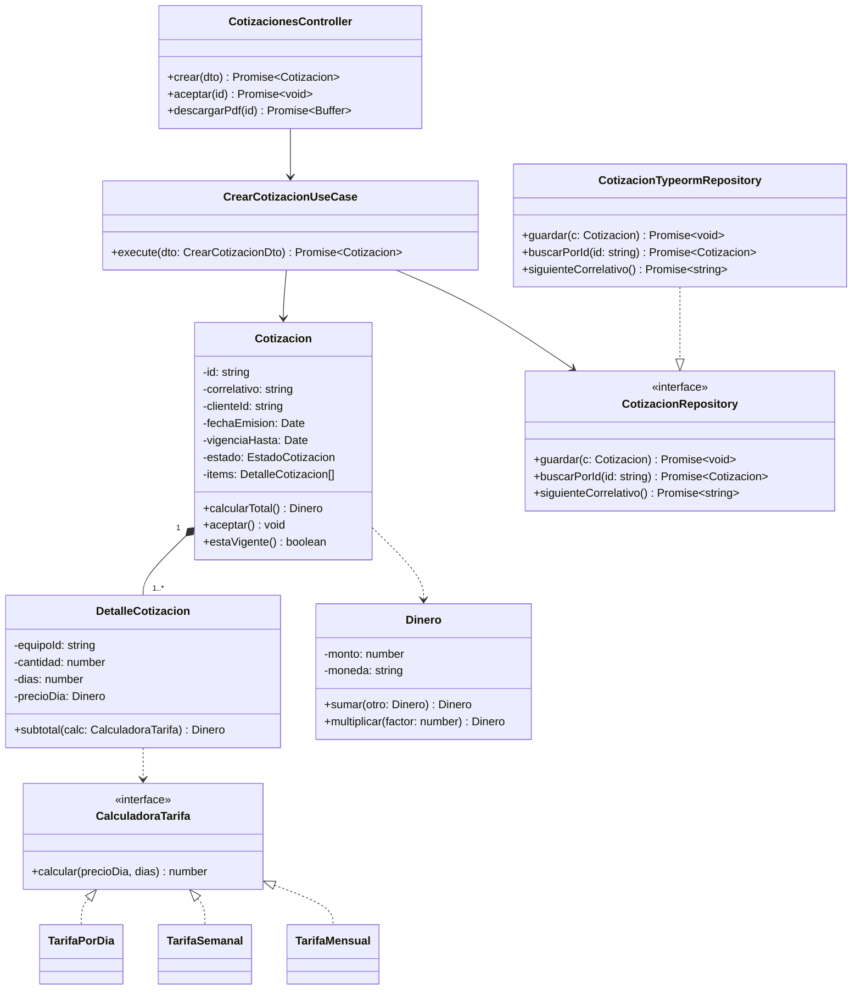
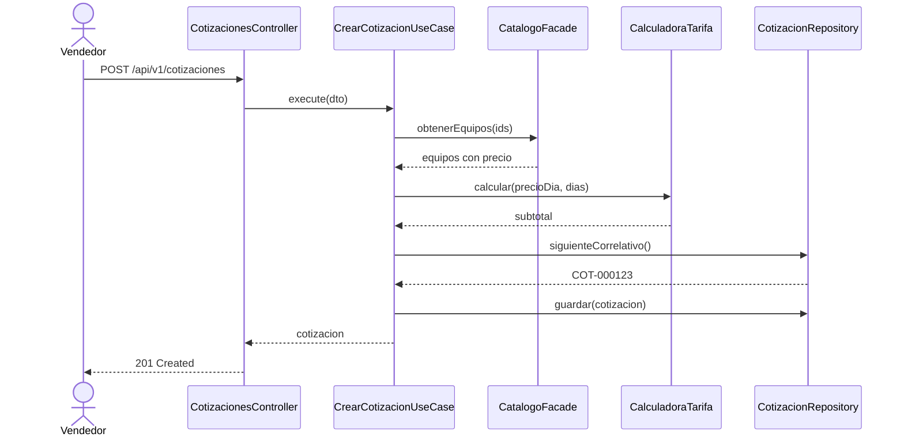

# C4 · Nivel 4 — Diagrama de código

Detalle de clases del módulo **Cotizaciones** (ejemplo representativo).

```mermaid
classDiagram
    class Cotizacion {
        -id: string
        -correlativo: string
        -clienteId: string
        -fechaEmision: Date
        -vigenciaHasta: Date
        -estado: EstadoCotizacion
        -items: DetalleCotizacion[]
        +calcularTotal() Dinero
        +aceptar() void
        +estaVigente() boolean
    }

    class DetalleCotizacion {
        -equipoId: string
        -cantidad: number
        -dias: number
        -precioDia: Dinero
        +subtotal(calc: CalculadoraTarifa) Dinero
    }

    class CalculadoraTarifa {
        <<interface>>
        +calcular(precioDia, dias) number
    }

    class TarifaPorDia
    class TarifaSemanal
    class TarifaMensual

    class Dinero {
        -monto: number
        -moneda: string
        +sumar(otro: Dinero) Dinero
        +multiplicar(factor: number) Dinero
    }

    class CotizacionRepository {
        <<interface>>
        +guardar(c: Cotizacion) Promise~void~
        +buscarPorId(id: string) Promise~Cotizacion~
        +siguienteCorrelativo() Promise~string~
    }

    class CrearCotizacionUseCase {
        +execute(dto: CrearCotizacionDto) Promise~Cotizacion~
    }

    class CotizacionTypeormRepository {
        +guardar(c: Cotizacion) Promise~void~
        +buscarPorId(id: string) Promise~Cotizacion~
        +siguienteCorrelativo() Promise~string~
    }

    class CotizacionesController {
        +crear(dto) Promise~Cotizacion~
        +aceptar(id) Promise~void~
        +descargarPdf(id) Promise~Buffer~
    }

    Cotizacion "1" *-- "1..*" DetalleCotizacion
    Cotizacion ..> Dinero
    DetalleCotizacion ..> CalculadoraTarifa
    CalculadoraTarifa <|.. TarifaPorDia
    CalculadoraTarifa <|.. TarifaSemanal
    CalculadoraTarifa <|.. TarifaMensual
    CrearCotizacionUseCase --> CotizacionRepository
    CrearCotizacionUseCase --> Cotizacion
    CotizacionTypeormRepository ..|> CotizacionRepository
    CotizacionesController --> CrearCotizacionUseCase
```

## Secuencia: crear una cotización

```mermaid
sequenceDiagram
    actor V as Vendedor
    participant C as CotizacionesController
    participant U as CrearCotizacionUseCase
    participant Cat as CatalogoFacade
    participant Calc as CalculadoraTarifa
    participant R as CotizacionRepository

    V->>C: POST /api/v1/cotizaciones
    C->>U: execute(dto)
    U->>Cat: obtenerEquipos(ids)
    Cat-->>U: equipos con precio
    U->>Calc: calcular(precioDia, dias)
    Calc-->>U: subtotal
    U->>R: siguienteCorrelativo()
    R-->>U: COT-000123
    U->>R: guardar(cotizacion)
    U-->>C: cotizacion
    C-->>V: 201 Created
```
