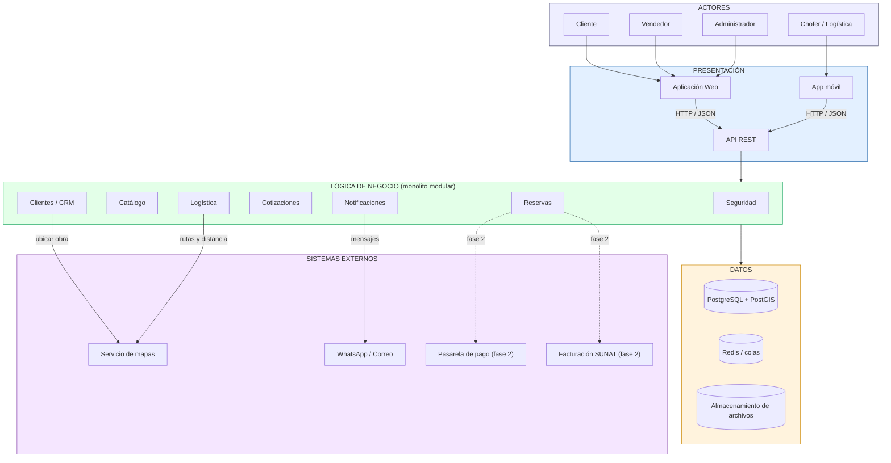
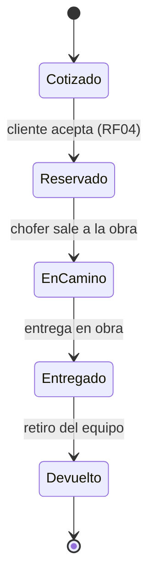

# Arquitectura inicial del sistema

## Diagrama de arquitectura

## Descripción

La arquitectura inicial es un **monolito modular organizado en tres capas**:

- **Presentación:** permite la interacción de los usuarios con el sistema mediante la aplicación web (vendedor, administrador y cliente), la app móvil (chofer, con modo offline) y la API REST que ambas consumen.
- **Lógica de negocio:** contiene los módulos responsables de las funcionalidades: Seguridad, Catálogo, Reservas, Cotizaciones, Clientes/CRM, Logística y Notificaciones.
- **Datos:** almacena y consulta la información en PostgreSQL con PostGIS, usa Redis/colas para caché y tareas asíncronas, y un almacenamiento de archivos para fotos, PDF y grabaciones.

Además, **Clientes** y **Logística** usan el servicio de **mapas**, **Notificaciones** usa WhatsApp/correo, y **Reservas** se integrará con **pagos** y **facturación SUNAT** en la Fase 2.

## Preguntas que responde cada capa

| Capa | Pregunta que responde |
|---|---|
| Presentación | ¿Cómo interactúa el usuario? |
| Lógica de negocio | ¿Qué hace el sistema? |
| Datos | ¿Dónde se almacena la información? |

## Responsabilidades de los módulos

| Capa | Módulo | Responsabilidad | Requisitos |
|---|---|---|---|
| Presentación | Aplicación Web | Interfaz para vendedor, administrador y cliente. | HU01–HU07, HU09–HU14 |
| Presentación | App móvil | Interfaz del chofer; funciona sin conexión y sincroniza. | RF08, AC09 |
| Presentación | API REST | Punto único de entrada del backend; valida y enruta solicitudes. | RC03 |
| Negocio | Seguridad | Autenticación JWT, roles y permisos; cifrado de datos personales. | RF10 |
| Negocio | Catálogo | Equipos y personal, fichas, fotos, calendario y disponibilidad; tarifas. | RF01, RF02, RF11 |
| Negocio | Reservas | Órdenes de alquiler, estados y control de dobles reservas. | RF04, RF08, RF13 |
| Negocio | Cotizaciones | Cálculo por día/semana/mes con flete, descuentos y garantía; PDF con correlativo y vigencia. | RF03, RF11, RF12 |
| Negocio | Clientes / CRM | Clientes, obras, direcciones en mapa e historial de contactos con consentimiento. | RF05, RF06, RF07 |
| Negocio | Logística | Programación de entregas y devoluciones; distancia para el flete. | RF06, RF08 |
| Negocio | Notificaciones | Envío de recordatorios por WhatsApp o correo. | RF09 |
| Datos | PostgreSQL + PostGIS | Clientes, equipos, cotizaciones, órdenes, estados y ubicaciones. | Todos |
| Datos | Redis / colas | Caché de disponibilidad y tareas asíncronas (notificaciones, PDF). | AC01 |
| Datos | Almacenamiento de archivos | Fotos de equipos, PDF de cotizaciones, grabaciones. | RF07, RF12 |

## Flujo de estados del alquiler

## Dependencias entre capas y módulos

- Cada capa se comunica solo con la **capa inmediata inferior** (Presentación → Negocio → Datos).
- Las aplicaciones web y móvil **no acceden directamente** a la base de datos; siempre pasan por la API REST.
- Los sistemas externos se invocan **únicamente desde la lógica de negocio**.
- Dependencias entre módulos: Cotizaciones → Catálogo y Clientes; Reservas → Catálogo y Cotizaciones; Logística → Reservas y Clientes; Notificaciones es invocado por Reservas y Logística; Seguridad es transversal.
- Cada módulo expone una interfaz interna y no lee las tablas de otro módulo, para poder separarlo como microservicio más adelante.

## Trazabilidad con los drivers

| Driver | Decisión arquitectónica inicial |
|---|---|
| DA01 | Reservas valida el cruce de fechas dentro de una transacción en PostgreSQL. |
| DA02 | Seguridad centraliza JWT, roles y cifrado; el consentimiento del cliente se registra en Clientes/CRM; HTTPS. |
| DA03 | Monolito modular con fronteras claras entre módulos. |
| DA04 | Notificaciones y mapas se aíslan en sus módulos; las tareas de envío se procesan en colas para que un fallo externo no bloquee el sistema. |
| DA05 | La app móvil guarda registros localmente y los sincroniza mediante la API al recuperar señal. |
| DA06 | Web y móvil consumen una única API REST. |
| DA07 | PostGIS para ubicaciones y distancia usada en el flete. |
| DA08 | Despliegue con Docker y CI/CD; caché de disponibilidad en Redis. |
